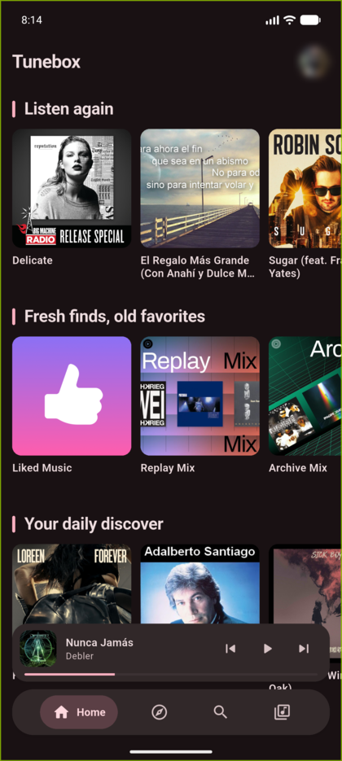
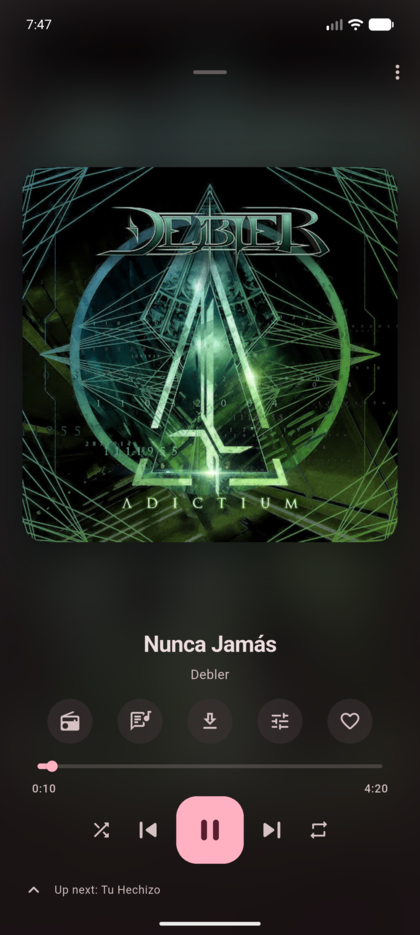
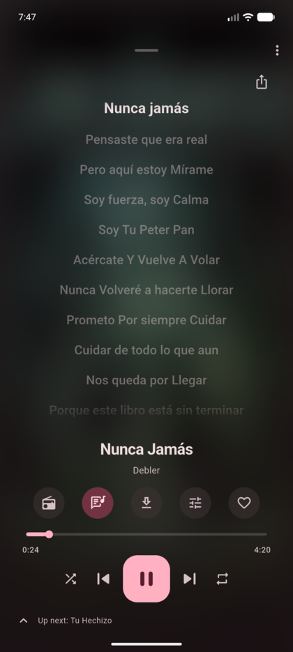
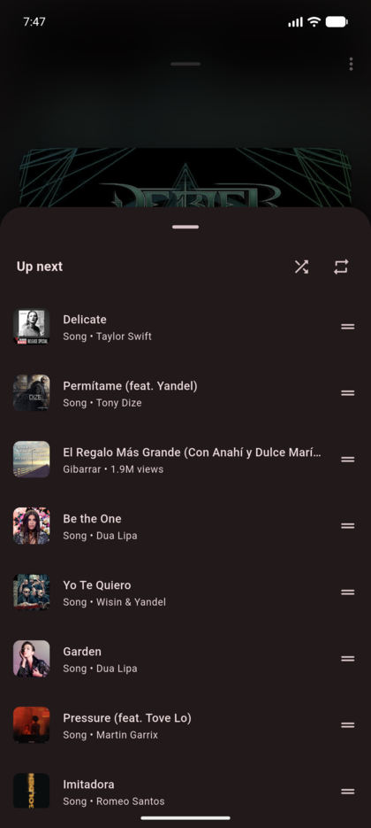
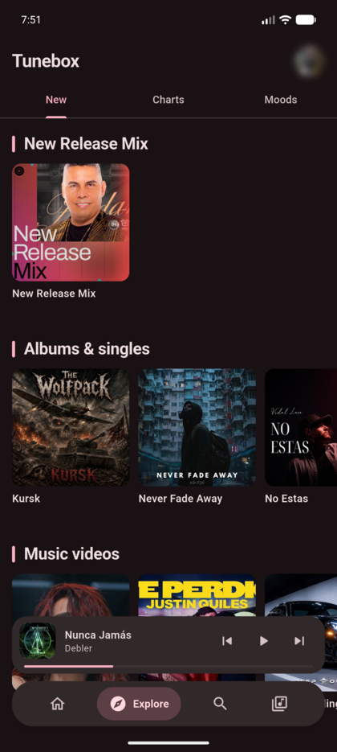
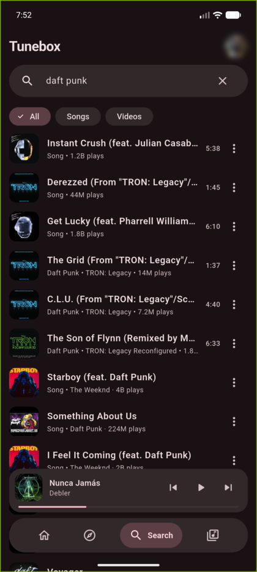
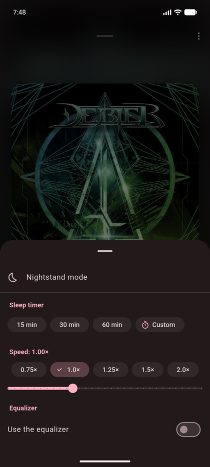
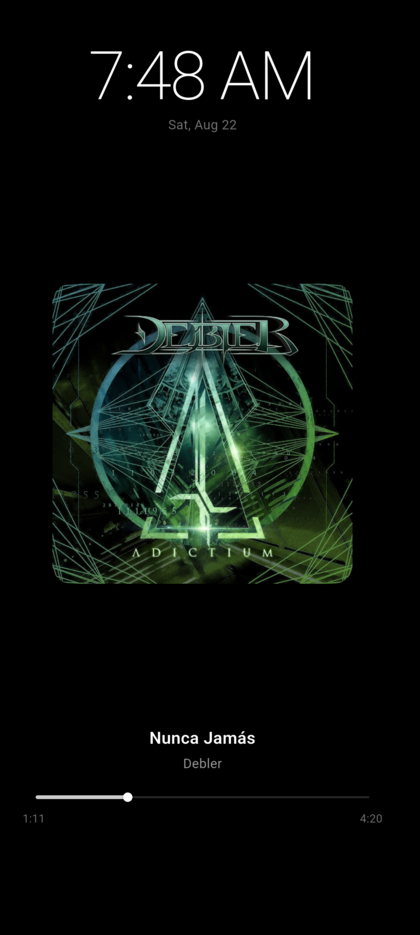
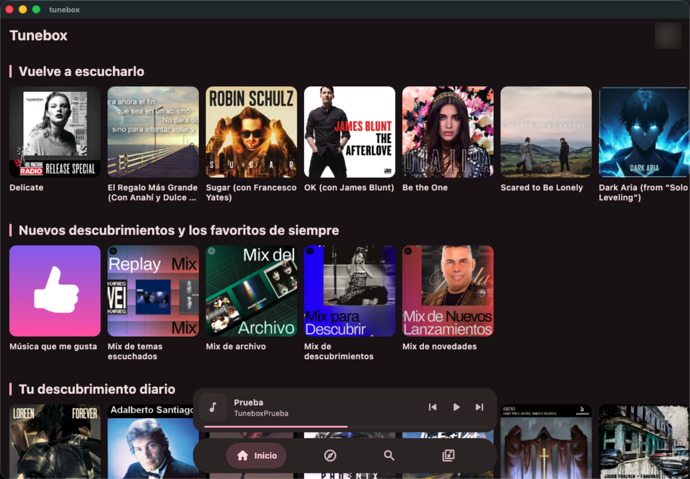
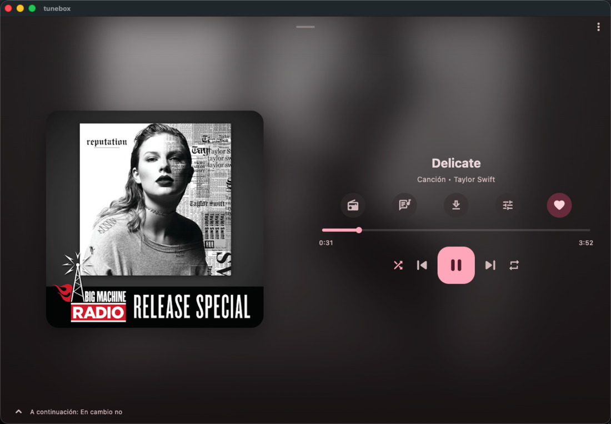

# Tunebox

[](https://github.com/duvanherfi/tunebox/releases/latest)
[](https://github.com/duvanherfi/tunebox/releases)
[](LICENSE)

Reproductor de música en Flutter que lee el catálogo de YouTube Music a través
de InnerTube, la API interna que usa la propia web de YouTube. Corre en Android
y en macOS, y se usa a diario.

**No usa microG ni Google Play Services.** microG existe para que las apps
parcheadas (ReVanced, Vanced) puedan iniciar sesión pese a no estar firmadas por
Google; esa capa emulada es justamente la que cuesta rendimiento. Aquí se habla
directo con la API por HTTP y el audio va a ExoPlayer nativo, sin WebView.

El historial **no** se escribe en la cuenta de YouTube: los pings se envían tal
y como los manda la web, YouTube responde 204 y no aparece nada en
`FEmusic_history`. Por eso el historial, las estadísticas y el scrobbling se
llevan en el dispositivo. Lo medido está en
[`docs/streaming-findings.md`](docs/streaming-findings.md).

## Cómo se ve

| Inicio | Reproductor | Letra sincronizada | Cola |
|---|---|---|---|
|  |  |  |  |

| Explorar | Buscar | Temporizador, velocidad y ecualizador | Modo mesita de noche |
|---|---|---|---|
|  |  |  |  |

En el Mac es la misma app y el mismo código; lo que cambia es que el reproductor
se abre a dos columnas y las estanterías caben enteras.





Las capturas de Android salen con la interfaz en inglés y las del Mac en
español: es el mismo build, leyendo el idioma del aparato. La foto de la cuenta
está difuminada a propósito.

## Instalar

El APK de cada versión está en las
[releases](https://github.com/duvanherfi/tunebox/releases). Es universal: un
solo archivo con `arm64-v8a`, `armeabi-v7a` y `x86_64` dentro, así que sirve
para cualquier teléfono con Android 7 o superior.

A partir de la 0.1.4 **la app se actualiza sola**: mira una vez al día si hay
una versión nueva, la ofrece y la instala. Comprueba que el APK descargado esté
firmado con la misma clave que la copia instalada antes de entregárselo al
instalador del sistema; uno que no lo esté se descarta. Se apaga en
Ajustes › System.

Windows y Linux no están: `audio_service` y `just_audio` solo declaran android,
ios, macos y web, y el reproductor **es** un `BaseAudioHandler`, así que esas
plataformas compilarían y morirían al arrancar el servicio.

## Compilar

```bash
flutter pub get
flutter test
flutter run
```

Para una compilación firmada hace falta `android/key.properties` —ignorado por
git— apuntando al almacén de claves:

```properties
storePassword=…
keyPassword=…
keyAlias=tunebox
storeFile=tunebox-release.jks
```

Sin ese archivo la compilación sigue funcionando y firma con la clave de
depuración. **La clave de release no se puede perder**: Android se niega a
actualizar una app instalada si la nueva versión viene firmada con otra clave, y
aquí no hay tienda que rehaga la firma por su cuenta.

Publicar una versión es `tool/release.sh <notas>`, que construye, comprueba la
firma y los recursos que el *shrinker* podría haberse comido, etiqueta y sube la
release con el APK nombrado por su número de compilación.

## Dónde está lo demás

- [`CLAUDE.md`](CLAUDE.md) — el mapa de trabajo: cómo está cableado el proyecto,
  qué decisión hay detrás de cada pieza y qué no conviene deshacer.
- [`docs/streaming-findings.md`](docs/streaming-findings.md) — lo que se midió
  contra los servidores de YouTube: por qué la reproducción necesita un proxy
  que trocee, qué identidades de cliente funcionan y qué pasa con el historial.
  **Léelo antes de tocar `core/innertube` o `core/audio`**: casi toda
  simplificación evidente de ahí ya se probó y falló.
- [`docs/pendientes.md`](docs/pendientes.md) — qué está hecho, qué falta y qué
  quedó a medias.

Si la reproducción deja de funcionar de golpe —`player` respondiendo 400 o
`LOGIN_REQUIRED` para todo—, no es un bloqueo ni un problema de cookies: es que
YouTube retiró el build del cliente. Sube `version` en los perfiles de
`lib/core/innertube/innertube_client.dart` y el *user agent* a juego. Es un
cambio de dos líneas y está explicado en `CLAUDE.md`.

## Licencia

GPL-3.0. Copyright (C) 2026 Duvan Hernandez Figueroa. El texto completo está en
[`LICENSE`](LICENSE).

Copyleft fuerte: puedes usar, estudiar, modificar y redistribuir este código,
pero si distribuyes una versión — con cambios o sin ellos — estás obligado a
publicar su fuente bajo esta misma licencia. Es la que usan NewPipe, InnerTune y
OuterTune, y viene sin garantía de ningún tipo.
